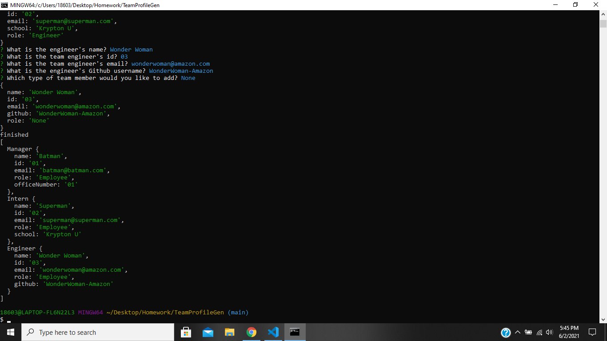
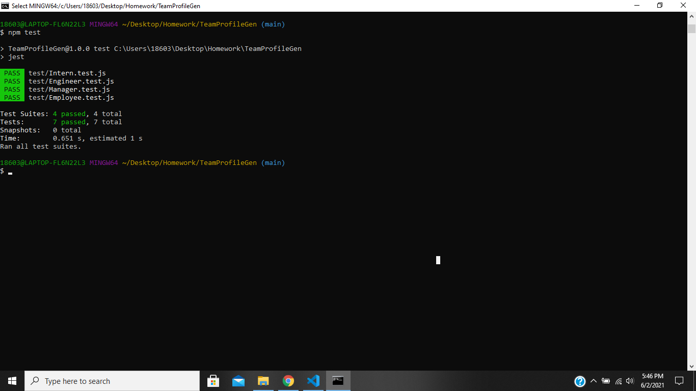

# TeamProfileGen
OOP Based App to Create a Team Profile

https://github.com/PratikPatel-Code/TeamProfileGen

#
## Project Overview:
The Project is supposed to be designed so you can create employees cards that appear in an html.
The class of employee would be manager, engineer, and intern.

#
## Project Goals:
1. Create tests to validate the information.
2. When you run node index.js, the app would appear and prompt questions.
3. Once you have finished with all the prompts, all data will be executed into an HTML

#
## Running the Application
- Install node.js and run npm index.js

#
## Testing the Application
- Install npm jest and run npm test

#
1. Video      :https://drive.google.com/file/d/1Eo5m28VFZoFEIZLkUH7AeIBRrm-4YSNN/view?usp=sharing
2. Test Video :https://drive.google.com/file/d/1rdAa_TOTlNXThtOuNPww2g8o3nvM0nAc/view?usp=sharing

#

#

#

## Conributers
[Pratik Patel](https://github.com/PratikPatel-Code/)

#
## Built With:
[Visual Studio](https://visualstudio.microsoft.com/)

[CSS](https://www.w3.org/TR/CSS/#css)

[JavaScript](https://www.javascript.com/)

[Node](https://nodejs.org/en/)

[Jest](https://jestjs.io/)

#
## Links:
[Email](pratikpatel_85@yahoo.com)

[Github Profile](https://github.com/PratikPatel-Code/)

[TeamProfileGen](https://github.com/PratikPatel-Code/TeamProfileGen)